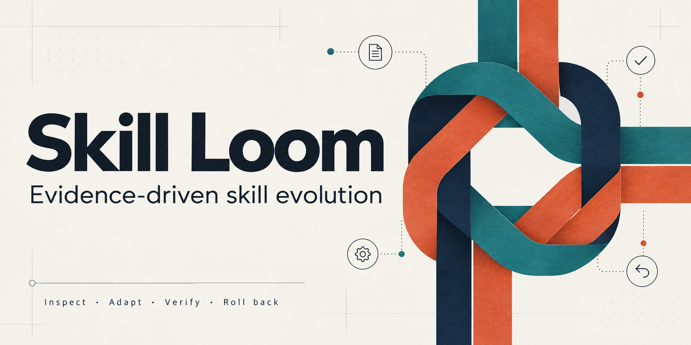
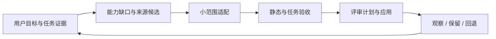

<p align="center"></p>

# Skill Loom

**Agent Skill Self-Evolution · 有证据、可回退的 Agent Skills 迭代工作台**

[English](README.en.md) · [快速上手](#五分钟运行一次闭环) · [技能目录](docs/skill-catalog.md) · [设计论证](docs/design-and-quality.md) · [研究论文](research/README.md) · [技术分享](docs/technical-blog.md)

Skills 越装越多，任务却不一定做得更好。Skill Loom 把用户需求、来源发现、任务缺口、候选评审、验证和回退组织成可复现流程，帮助你维护适合自己的技能体系。

它提供本地 Python CLI、Codex/Claude Code 适配指南、39项匿名化技能目录，以及一组可运行的故障注入实验。第一版是**研究与工程原型**：支持受控维护，不是自动抓取全球资源、自动证明质量的托管服务。

## 五分钟运行一次闭环

需要 Python 3.10+。克隆后在项目根执行；命令在 Windows PowerShell 与常见 Unix shell 使用相同的 Python 参数。

```bash
git clone https://github.com/Koooki3/skill-loom.git
cd skill-loom
python -m venv .venv
```

Windows：

```powershell
.venv/Scripts/python -m pip install -e .
.venv/Scripts/python -m skillloom demo --workdir ../skill-loom-demo-001
```

Linux/macOS：

```bash
.venv/bin/python -m pip install -e .
.venv/bin/python -m skillloom demo --workdir ../skill-loom-demo-001
```

demo 会在一个**新目录**中构造缺失引用，形成修复候选，安装、检查、回退、重新应用，再确认无变化退出。再次运行请换一个新目录；它不会删除旧演练。下面命令中的 `python` 指你选择的虚拟环境解释器。

```bash
python -m skillloom doctor --profile examples/user-profile.json --out ../loom-state/doctor.json
python -m skillloom gaps --profile examples/user-profile.json --catalog catalog/local-skills.example.json --observations examples/observations.json --out ../loom-state/gaps.json
python -m skillloom portfolio --profile examples/user-profile.json --catalog catalog/local-skills.example.json --out ../loom-state/portfolio.json
python -m unittest discover -s tests -v
```

## 从自己的需求开始

复制 `examples/user-profile.json` 到私有目录，填写你的能力需求、预算和允许观察的范围。它是示例，不是普遍最优参数。只读盘点实际技能根：

```bash
python -m skillloom inventory --root '<your-skills-root>' --out '<private-state>/inventory.json'
```

安装本项目附带的 `skills/skill-lifecycle` 时，按[宿主适配](docs/host-adapters.md)选入口，并使用 `plan` / `apply`。如果已有等价维护 skill，优先适配原入口，避免重复触发。第三方目录仅供参考，本仓库不会一键安装全部39项。

## 六个问题，一条维护链

| 你遇到的问题 | 项目提供什么 | 命令 / 文档 |
|---|---|---|
| 怎样找到值得采用的新技能 | 有范围的公开检索、固定来源变化检查、证据评分 | `scout` · `discover` · `stage` · `rank` |
| 本地究竟缺什么 | 显式需求、能力提供者、任务失败原因分开 | `observe-codex` · `events` · `gaps` |
| 技能越来越重复 | 能力重叠候选、用户预算、触发边界与退役流程 | `portfolio` · [路由与协作](docs/routing-and-teams.md) |
| 不同用户怎么适配 | 私有可编辑profile、小范围试点、环境初筛 | `doctor` · [设计与质量](docs/design-and-quality.md) |
| Codex/Claude等能否共用 | 文件级内核、分别核验的宿主适配与降级 | [兼容性合同](docs/compatibility-contract.md) |
| 更新出问题怎么办 | 精确变更计划、原文件备份、漂移拒绝、回退 | `plan` · `apply` · `rollback` |



`gate` 检查验收记录与产物哈希，可绑定任务、候选和时效。可选Stop hook最多提供一次修复机会，失败耗尽仍保留未验证状态。hook不是授权系统，哈希也不能证明报告内容正确。

## 当前证据

[实测记录](docs/validation.md)区分本地软件测试、故障注入、本机部署与未验证平台。[可复现实验](research/results/invariants.json)包含12个手工构造的软件合同场景；它们不是LLM任务准确率或与现有学术系统的性能排名。

文献研究覆盖技能库、反思、进化搜索、压缩、过程评价与多轮退化。[文献矩阵](research/literature-matrix.md)记录阅读位置、版本和反证；本项目不将已有思想重新包装为原创算法。

## 按需阅读

| 路径 | 内容 |
|---|---|
| [技能目录](docs/skill-catalog.md) | 33项通用与6项项目范围技能：功能、来源、安装、依赖 |
| [迭代手册](docs/evolution-playbook.md) | 从运行记录到搜索、自制、适配、验证、增减合并 |
| [路由与多agent](docs/routing-and-teams.md) | 最小组合、SOLO/ONE/TWO、写入所有权和研究/生产验收 |
| [环境与文件](docs/environment-and-outputs.md) | 产物归属、文档更新、可重建缓存清理 |
| [跨宿主适配](docs/host-adapters.md) | Codex/Claude安装入口、发现、代理和hooks差异 |
| [设计论证](docs/design-and-quality.md) | 来源覆盖、质量评分、客制化、冗余与长期更新 |
| [发布与维护](docs/releasing-and-governance.md) | 项目自己的版本、贡献、升级与回退 |
| [学术论文](research/paper.md) / [技术博客](docs/technical-blog.md) | 理论依据、原型方法、实测与限制 / 实用上手 |

## 范围与贡献

没有后台采集、无声自动更新或默认付费模型调用。仅显式选择的本地记录被观察；原始日志、真实profile和回退记录留在仓库外。任务缓存清理需要归属标记、精确计划和摘要，不处理宿主凭据、数据库、会话或插件。

欢迎提交真实任务缺口、最小复现和宿主验证结果。见[贡献指南](CONTRIBUTING.md)、[安全说明](SECURITY.md)和[变更记录](CHANGELOG.md)。代码与原创文档采用 [MIT](LICENSE)；被引用技能和论文保留各自许可，目录不授予它们新的分发权。
