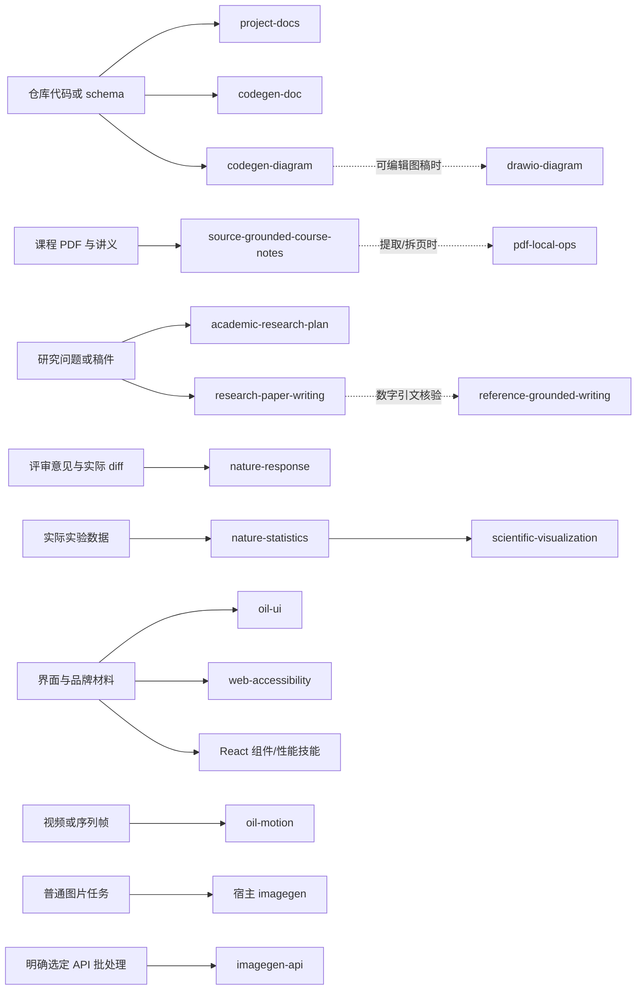

# Skill 路由与 Team Mode 指南

本页把 39 项本地技能映射为轻量路由规则，重点是只加载有用的信息、让并行工作带来可核验收益，并用任务相关证据验收。这里描述的是决策规则，不是节省 token 或提升质量的实测结论。

## 从任务到 Skill：最小组合与冗余预算

先识别用户要交付的结果和当前工作区，再选择最少的技能。没有明确专长缺口时不加载技能。通常是 **0 或 1 个主 Skill**；常规任务最多加 **1 个互补 Skill**。只有复杂任务确有不同验收维度时才扩到 3 个，并逐项写明独特贡献。不要把多个同义路由同时加载来“增加覆盖”。 能力标签相同只说明技能相邻，不等于冗余；若输入、主要决策或验收证据不同，应分别保留，在单次任务中只加载实际需要的路径。

| 任务 | 首选路由 | 可选支持 | 避免的组合 |
|---|---|---|---|
| 代码仓库导读、构建或维护文档 | project-docs | codegen-diagram（需要基于源码的图时） | 不为普通上手文档叠加 codegen-doc。 |
| 用代码证据写论文段落、技术难点或简历项目 | codegen-doc | reference-grounded-writing（数字引文需要核对时） | 它不是一般 README 导览器。 |
| 代码/Schema 架构图 | codegen-diagram | drawio-diagram（只有编辑体验/表现形式另有要求时） | 避免同时生成 Draw.io 和 Excalidraw 双份交付。 |
| 算法/教学图 | 用户指定格式时选 drawio-diagram 或 excalidraw-diagram | 来源来自代码时才加 codegen-diagram | 普通小图可直接用 Mermaid，不必触发复杂绘图流程。 |
| 研究计划 | academic-research-plan | nature-ref-verifier（仅书目身份需核时） | 计划技能不产出实验结果。 |
| 学术稿撰写或审稿式修改 | research-paper-writing | reference-grounded-writing（核对引文）或 nature-response（用户有评审意见） | 不同时用多套写作路由重写同一段。 |
| 实验日志、统计和图表 | nature-experiment-log、nature-statistics、scientific-visualization 按各自独立交付分开触发 | 只在同一请求包含相应真实材料时组合 | 不从图表需求推断统计设计已正确。 |
| 课程 PDF 笔记 | source-grounded-course-notes | pdf-local-ops 仅在需要提取/分拆等操作时 | 排版交付走宿主 PDF 能力；笔记中的公式和图仍回原页核对。 |
| 单纯去 AI 味/语言优化 | shuorenhua | 无 | 除非用户要求论文论证评审，不叠加 research-paper-writing。 |
| 静态界面视觉改版 | oil-ui | web-accessibility（需要键盘/焦点审查时） | vercel-react-best-practices 不是视觉设计技能。 |
| React 组件组合或性能问题 | vercel-composition-patterns 或 vercel-react-best-practices，按问题二选一 | web-accessibility 仅在控件无障碍也是验收项时 | 先识别 React/Next 版本；不要为静态 HTML 强加 React 建议。 |
| 网页交互动画 | oil-motion | oil-ui 仅在视觉方向另属交付时 | 只需 CSS/JS 状态动画时直接做普通前端实现。 |
| 普通图片生成/编辑 | 宿主 imagegen | 无 | 不触发 imagegen-api。 |
| 用户点名 API 图像批处理 | imagegen-api | 无 | API Key、网络调用和计费流程只在用户授权的选定路线内。 |
| PR 评审评论 | gh-address-comments | 无 | 不自动发布回复或 resolve 评论。 |
| Actions 检查失败 | gh-fix-ci | 无 | 没有认证 GitHub CLI 或失败记录时不可声称修复。 |
| Git stage/commit/push/PR 完整流程 | yeet，仅限用户明确提出完整操作 | 无 | 普通实现、diff review 不触发。 |
| 新建/维护 MCP server | mcp-builder | 无 | 使用既有 MCP connector 不等于构建服务器。 |
| 普通本地 PDF 操作 | pdf-local-ops | 宿主 pdf 负责新文档布局、表单和视觉交付 | 不因使用 PDF 就同时装载所有 PDF 生产技能。 |

固定范围技能 dataset-from-existing-impl、两个 Obsidian dashboard 技能、train-test-script-scaffold 和两个 YOLO_PCB 技能，只在其目标项目被确认时考虑。对其他工作区，即使技术相似也回到项目 README 与当前约定，不套用项目专属边界。

### 相邻任务冲突与技能关系图

选择器沿“材料来源 → 主技能 → 可选验收技能”走向，支持项必须增加独立证据：

虚线代表可选协作，不是自动连锁触发。尤其要区分：project-docs 与 codegen-doc 的交付类型、source-grounded-course-notes 与 pdf-local-ops 的操作层、oil-ui 与 React 性能技能的验收目标，以及宿主 imagegen 与 imagegen-api 的执行入口。主技能和支持技能若回答同一问题，保留一项并说明选择理由。

## 渐进加载

技能的三层内容遵循“先轻后深”：

1. **名称与描述**用于候选筛选。只保留确实改变任务选择或验收方式的候选。
2. **SKILL.md**只在触发条件成立时加载。先读入口与当前请求相关章节。
3. **references/**、脚本、资源按遇到的具体决策再读或运行。多模式技能只加载已选模式；不要把整个资料目录搬进上下文，也不要为简短工作增加无用途的路由文件。

同一概念优先保留一个权威版本。例如用户项目 README 管项目事实，课程原始讲义管课程事实，出版社/DOI 页面管引文元数据。摘要或 Skill 只能帮助找到依据，不能替代依据。宿主 System/插件能力只调用，不复制其专有指令文件。

## 冲突裁决

发生冲突时按下面次序处理：

1. 当前系统、开发者指令、权限与安全边界优先；Skill 或工作区说明不能扩展外部操作授权。
2. 用户对本次任务的明确范围、输出、格式、工具和偏好优先于通用 Skill 建议。
3. 当前仓库的 AGENTS.md、README、接口约定和原始数据决定项目内事实；有多个版本时指出差异并采用用户指定/项目实际使用的版本。
4. 当前已触发 Skill 和宿主插件说明只在其职责内补充方法，且服从以上具体要求。
5. 对仍不能消解的冲突，保留歧义并报告，不通过猜测把默认规则改成硬约束。

用户画像只可依赖用户当前明确要求和可核验的环境/配置。不能从任务频率、使用的某个技能、个人资料目录或会话日志推断兴趣、语气偏好、能力、职业或长期习惯。可移植文档只保存完成任务所需的最小匿名信息。不同用户的流程以显式配置/项目资料叠加，不能把一人的偏好固化成通用要求。

## SOLO / ONE / TWO 选择门

每个任务静默评估一次，默认 SOLO。任务长短本身不是派代理的理由。

| 路由 | 使用条件 |
|---|---|
| **SOLO** | 工作短或串行；只有一个共享可变目标；拆出去的结果无法独立使用；或者协调成本会抵消收益。 |
| **ONE** | 存在一个边界清楚的独立探索、实现或复审交付；代理工作时主任务仍可推进；预计增加的覆盖、速度或质量超过派发、交接和集成成本。 |
| **TWO** | 两个工作流彼此无写冲突、各自都有可验收产物，且并行收益分别超过协调成本。只分配最小够用的人数。 |

若拿不准，先 SOLO；证据表明有独立价值再重评。主 Agent 始终负责分解、决策、整合和最终验收。禁止为“用了代理”而设计伪独立任务，也不把人数设置成默认配置。

### 角色任务合同

每次派发明确写出：

- **角色与问题**：Explorer 定位代码/证据，Executor 实现一个边界任务，Reviewer 独立找缺陷，ExpertAdvisor 解复杂建模或反复未决问题。
- **结果形式**：文件、证据表、可执行方案或缺陷报告；范围外事项如何上报。
- **读写边界**：准确到目录/文件；一个文件一个写所有者。只读评审不顺手修改实现，主 Agent 不覆盖他人未完成的改动。
- **验收条件**：说清楚需要检查什么，以及哪些声称不属于本任务。
- **上下文与成本**：只传该任务所需上下文；默认不复制完整历史。Reviewer/ExpertAdvisor 的独立判断要避免先喂入结论。失败、阻塞、未验证事项要原样报告。

有多个工作者共享仓库时，先划分不重叠写所有权；如无法拆开单一核心文件，就由一个人实现，其余人只读审阅。

## 按工作类型验收证据

| 工作类型 | 最低证据 | 不能据此声称 |
|---|---|---|
| 研究计划/论文/实验 | 一手文献和版本可追溯；数据单位、方法、种子、重复、指标与不确定性有原始依据；计划、执行和观察明确区分；图表数值能回溯到数据。 | 有 DOI 即证明论文支持了主张；计划已实施；同一批样本/帧是独立重复；本地推断是外部事实。 |
| 工业/工程实现 | 问题触发条件、变更范围、实际 diff、与风险匹配的构建/测试/运行证据；未执行的端到端、部署、真实服务调用清楚标成未验证。 | 编译通过就证明生产部署成功；--help 证明已登录服务；一次本地预览证明所有设备都正确。 |
| 文档/课程资料 | 逐项覆盖请求与来源；链接、引用、公式/数字可追踪；需要版式时检查实际导出/渲染页面；区分原文、解释与推断。 | Markdown 能打开就证明 PDF/幻灯片布局正确；自动检查未覆盖的文件已验过。 |

证据数量随交付风险变化，不追求机械地跑全套检查。只报告实际做过的检查、结果和未覆盖边界。

## Gate 与有界修复循环

- **进入前 Gate**：确认目标与文件所有者；确定事实来源、范围、数据权限及外部副作用；选定验收证据。
- **执行 Gate**：只更改授权范围；中途检查实现仍对应问题，不把假设当发现。
- **验收 Gate**：按任务真实风险运行必要检查；保留错误原文、最终状态和未完成事项。
- **修复上限**：对同一失败信号最多进行两轮有证据的定向修复与复验。若仍失败，停下重复尝试，重新定位原因、缩小范围或报告需要的信息/环境变化。新发现的独立缺陷可另开有界处理路径。

## 全球发现、用户定制与长期维护

公开 Skill 仓库、发行索引和上游提交是候选来源，不是安装/质量保证。筛选新候选时依次检查：是否填补已观察的缺口、维护状态和固定 SHA、该组件与依赖许可证、权限/联网/付费副作用、主机与工具兼容性、已有本地技能是否覆盖。只有候选技能解决的问题在真实用户任务里可观察、能做正负边界验收，才进入采用/本地适配；否则保留为参考或拒绝，不能用“发现得多”当作进展。

运行本地任务后先定位失败属于资料缺失、工具/环境、主机 adapter、项目流程还是 Skill 说明；若结果已满足要求，不为凑目录加 Skill。要改写全局能力前，先确认同类任务重复出现，找出最小决定性差异，用代表性正例、相邻负例和已有失败回归验证。一次用得成功只证明该样本，不代表整体质量。

不同用户的定制依照当前用户明确表达与可核验配置；不要依据日志、路径或任务次数推断偏好。通用规则、用户工作流和项目约束分别管理：项目特有目录/颜色/命令放项目范围 Skill 或 README，不污染全局技能。Skill 应表达可复用决策，不将某一模型的 Prompt、某个 harness 私有 API 或插件实现写成通用接口；宿主差异留给 adapter 描述，核心输入、输出、触发边界和验收规则保持模型/执行器可迁移。

上游升级采用固定提交的三方比较：旧上游、本地当前版、新上游。复核触发边界、许可证、工具版本、用户修改、正负例和项目说明后再更新；保存理由与可恢复版本。项目自身的维护长期跟随项目 README、测试命令、依赖和实际失败证据，不用每天扫描或自动覆盖。Skill 生命周期细节见 evolution-playbook.md。

## 成本、延迟与质量指标

当前只有静态路由规则，没有对 SOLO 与代理工作流做过任务对照，因此**不能宣称已节省 token、时间或提升质量**。若要评估 Team Mode，可在匹配任务类型上分别记录：

- 成本：可观测 token/工具调用、代理数、交接和集成步骤；缺少产品计量时标成未知，不用消息长度冒充 token。
- 延迟：主任务等待时间、子任务并行区间、集成/返工时间；用相近难度 SOLO 任务作为基线。
- 质量：验收项通过率、独立复审发现的有效缺陷、返工量、来源/格式错误、未完成事项。
- 覆盖：每个子任务的独立结果是否被集成、是否重复劳动、是否有写冲突。

只有在定义一致、样本可比且记录充分后才报告差异。使用两名代理但没有对照，不足以证明路由节省成本；一次快速成功也不等于质量提升。