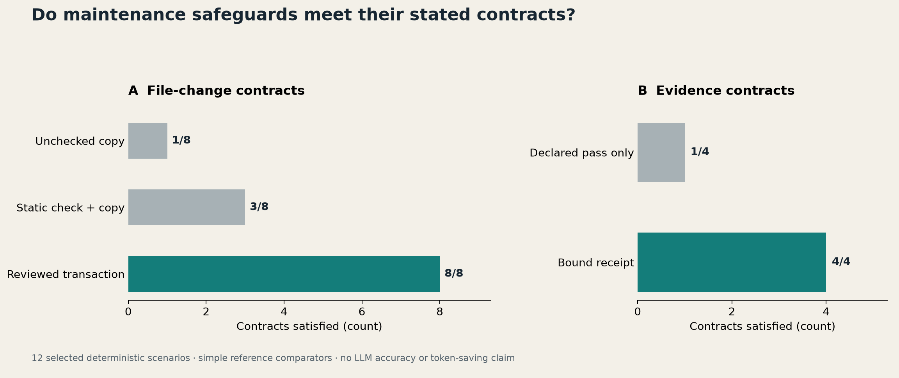

# Skill Loom：让 Skills 的每一次更新都有依据

一个常见的开始是收藏一个 skills 清单，安装几个看起来有用的目录。几周后，研究写作、PDF、绘图、代码评审都有了入口。真正的问题随后出现：两个入口都能响应同一句话，该选谁？某次任务失败，究竟是 skill 不够好，还是工具没装好？上游更新后，本地保留的约束会不会被覆盖？

Skill Loom 从这些维护问题出发，提供一个可以本地运行的小工具和一套可移植工作流。首版包含 Python CLI、39项匿名化技能目录、Codex/Claude Code 适配指南、故障注入实验及配套技术报告。下面讲清楚它已经做到什么，以及为什么这样设计。

## 先分开三个问题

“发现一个候选”“正确修改技能库”“让任务做得更好”是三项不同的成果。搜索结果能支持第一项，事务日志能支持第二项，第三项需要真实任务对照。

[SkillsBench](https://arxiv.org/abs/2602.12670v4)提醒我们，技能的效果依赖任务和使用条件。[关于多轮自迭代的研究](https://arxiv.org/abs/2608.02636v1)也没有支持“多改几轮一定更好”。[技能生命周期综述](https://arxiv.org/abs/2607.10113v1)已经讨论了发现、准入、维护与治理。[SkillZip](https://arxiv.org/abs/2608.11079v2)则是结构保留、溯源和确定性宿主操作的重要相关工作。

因此，这个项目不把维护闭环说成新的学习算法。它的价值在于将这些区分落到一个普通用户能检查、运行和回退的实现中。详细的阅读位置、版本与局限保存在[文献矩阵](../research/literature-matrix.md)，没有把不同论文的结果拼成排行榜。

## 从需求档案开始，避免为安装而安装

第一次接入只需要三类信息：你要完成哪些任务、怎样判断产出合格、允许观察和修改哪些本地位置。档案由使用者编辑，原始任务和日志留在私有目录。

```bash
python -m skillloom doctor --profile examples/user-profile.json --out ../loom-state/doctor.json
python -m skillloom inventory --root '<your-skills-root>' --out ../loom-state/inventory.json
```

`doctor` 只检查 profile、OS、Python 和几个命令是否在 PATH。它不会因为看到一个用户名或文件夹名就推测偏好，也不会把“找到 codex 命令”写成“已验证所有 Codex 功能”。

接着，把真实任务中的需求和失败原因整理成结构化观察：需要什么能力、结果如何、证据在哪里、原因更像环境还是 skill。无法判断就标 `unknown`。

```bash
python -m skillloom gaps --profile examples/user-profile.json --catalog catalog/local-skills.example.json --observations examples/observations.json --out ../loom-state/gaps.json
```

环境故障先修环境；已有技能出错先复现；缺少能力提供者才考虑搜索或制作。比如 PDF 提取失败可能只是缺少运行依赖，增加另一个 PDF skill 未必解决问题。CLI 不替你理解所有原始成果，观察的归因仍需要人或 agent 检查。

## 搜索要有范围，质量要有证据

[`best-skills`](https://github.com/xstongxue/best-skills)和[`awesome-agent-skills`](https://github.com/VoltAgent/awesome-agent-skills)可以作为发现入口。官方仓库、领域维护者、论文和用户提交提供其它线索。索引里的一个名字只是候选，不构成采用依据。

```bash
python -m skillloom discover --registry catalog/sources.json --out ../loom-state/discovery.json
python -m skillloom scout --query 'agent skills evaluation in:readme' --per-query 5 --out ../loom-state/scout.json
```

`discover` 比较已登记来源的完整 commit；`scout` 使用明确的公开关键词检索 GitHub。它们都不会安装。查询不能携带私有项目名或原始故障记录；检查失败会留下 unavailable，不能假装“没有更新”。

采用前分别检查来源与许可、权限与副作用、目标工具可用性、本地行为证据。用户相关性、可维护性、效率和可移植性可以帮助排序，但一个很高的分数不能抵消缺失的许可证或未经验证的行为。`rank` 的输出叫 `queue_score`，因为它只是调查顺序。没有证据引用的维度保持未知。

暂存使用完整 SHA，并核对下载字节的 Git blob 身份及长度，再保留 SHA-256 清单。静态检查不执行下载来的代码，也不证明它没有恶意行为。

## 一次变更如何留下可回退的记录

先把适配后的候选放在独立目录，再生成计划：

```bash
python -m skillloom plan --candidate '<candidate>/my-skill' --root '<physical-skills-root>' --journal '<private-state>/journal' --out '<private-state>/plan.json'
python -m skillloom apply --plan '<private-state>/plan.json' --digest '<review_digest>'
python -m skillloom rollback --transaction '<transaction-directory>'
```

计划列出改动前后状态、文件哈希和支持的权限模式。应用时重新检查候选和目标；计划以后有人改了文件，就停止。修改原文件前先保存备份，完成后再核对目标状态。回退也检查后续编辑，避免拿旧备份盖掉用户的新工作。

这里没有“多文件瞬间原子完成”的承诺。中断可能留下部分变更，journal 用于识别和恢复。操作期间需要一个写入所有者；ACL、扩展属性以及同用户恶意进程竞争不在当前保证范围内。计划摘要用来绑定已检查的内容，不是数字签名，更不代替用户授权。

无变化也是有用的结果。工具确认当前状态与计划一致后返回 `no_change`，不为了制造更新而添加规则。

## Gate 与 hook 的职责要小

不同交付物需要不同验收：研究任务关心来源、复现和统计；生产任务关心测试、运行表现与回退；文档关心事实保真和渲染。Skill Loom 的 receipt 记录这些检查及其证据文件哈希，还可绑定任务、候选和时效。

receipt 的限制很直接：一个内容错误但哈希正确的报告仍是错误报告。gate 能发现证据文件改了、记录属于另一个任务或已经过期，却不能凭空证明报告内容属实。

可选 Stop-hook 示例在第一次失败时给一次有限修复机会；再次停止时允许结束并保留失败状态。它不会通过无限循环逼出一个“pass”。当前版本只测试了适配脚本，本机未启用原生 hook；具体配置按[宿主说明](host-adapters.md)分别核验。

多 agent 也遵循同样的克制：只有独立交付物带来的收益超过协调成本时才委派。审计者可以核查来源，主代理负责集成，实际变更只留一个写入所有者。模型、工具、上下文和预算变化时，应重新测试效果，不能从“开了三个 agent”推导“更高质量”。

## 怎样避免技能库变成维护负担

把全局通用技能、领域技能、项目技能与候选/退役记录分开。运行发现目录只保留需要触发的版本。触发描述说清适用条件；长参考按需加载；确定性操作交给脚本。

`portfolio` 会标出能力高度重叠的候选对和用户自定预算超限，但不会自动合并或删除。研究统计与科研绘图可能共享领域词，却有不同产物和验收，应该保留边界。低频不等于无用，未观察到使用也不能作为删除理由。

清理文件同样先判断归属：仅对明确标记为可重建、由本工具管理的任务缓存生成精确文件计划。真实成果、回退日志、凭据和宿主数据库不属于缓存。此次本机检查没有发现可明确清理的用户技能字节码缓存，于是没有执行全局删除。

## 实际做过哪些验证

首版在一个含39项用户技能的 Windows Codex 环境中，修改现有 `skills-maintenance` 的两个文件，增加按需引用；完成应用、静态检查、回退、原状态核对、重新应用与无变化检查。技能数量仍为39，受保护的全局配置和指令文件哈希没有变化。

另有12个开发期间选取的故障场景：8个文件变更/回退场景，4个证据场景。受控事务满足8/8个指定合同，绑定证据满足4/4个指定合同。对照是刻意简单的复制和声明接受实现，不能把这个结果当成优于已有学术系统的证明。



独立评审找出了 POSIX 权限丢失、无变化计划漏查漂移、清理中断记录不完整、Git blob 核验缺失和非有限时效参数等问题；我们先复现再修复，留下回归测试。最新测试数、CI、平台跳过项和实测边界见[验证记录](validation.md)。

## 下一版应该由什么推动

真实缺口比功能清单更有价值。优先收集可复现的误触发、适配失败、候选拒绝和升级回退案例；在固定任务、模型、工具与预算下比较无 skill、当前版本和候选版本。保留未用于修改的任务，记录失败、无变化和退役，而不只展示成功案例。

跨宿主的文件规范可以共享，hooks、目录发现、权限和模型行为必须分别核验。当前版本是可运行的本地维护工具，不是已经验证的多租户自动服务。欢迎从一个小任务开始运行 [demo](../README.md)，提交匿名最小复现；项目自己的更新也应接受同一套证据与回退要求。
